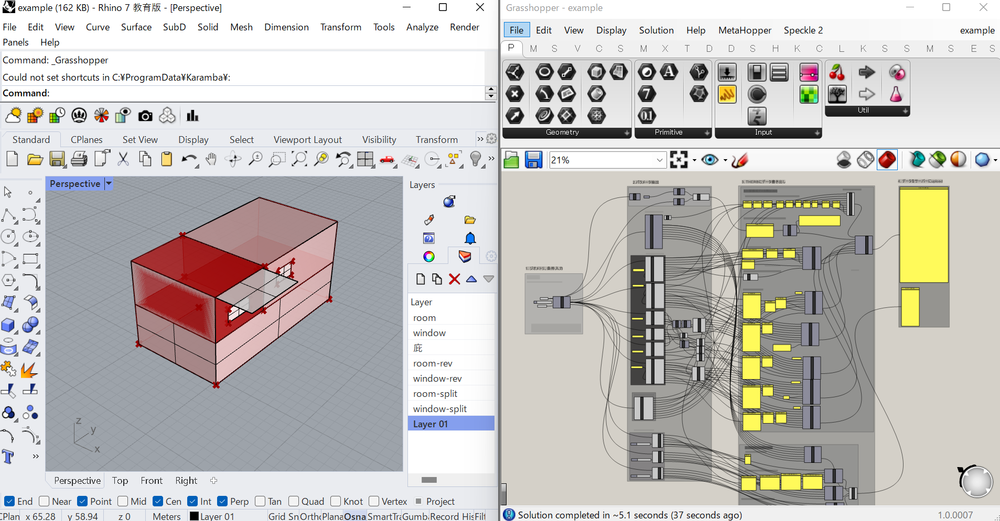

## インストール方法

THERB-GH のインストール方法について紹介します。

1. [githubページ](https://github.com/becat-oss/therb-gh) からzipファイルをダウンロード
1. ダウンロードした zip ファイルを右クリックしプロパティから全般のタブの中にあるセキュリティの項目を「許可する」にし、zip を解凍する
1. Grasshopper を起動して File > Special Folders > Components folder を選択することで表示されるフォルダに、1. でダウンロードしたフォルダの中にある 「installer/THERB-GH.gha」 という名前のファイルを入れる
1. Rhino を再起動する  
1. 1でダウンロードしたフォルダの中にある「example/example.3dm」というRhinoファイルを開く  
1. Grasshopperを起動する  
1. 「example/example.gh」ファイルをGrasshopper上で開く  

以上がうまくいくと、THERB-GHを使うことができます。  
以下のような形になります。  

:::note
うまく動作しない場合は 2. のやり忘れの場合が多いです。注意してください。
:::

## 動作環境

対応OS
- Windows

対応バージョン
- Rhino7