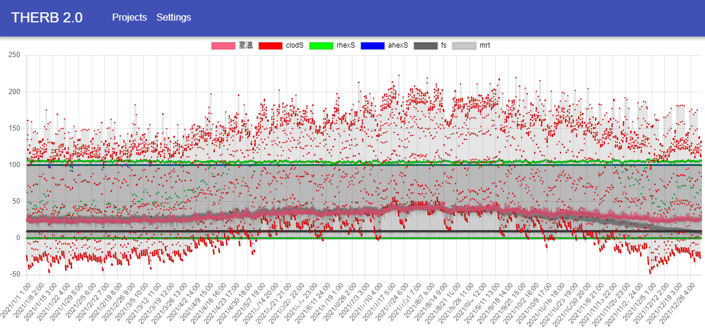

RhinoモデルからTHERBのデータを抽出できたら、そのファイルをサーバーにuploadして計算、データ処理、ビジュアライゼーションを行います。  

## 前提条件  
[therb-backend](https://github.com/becat-oss/therb-backend)と[therb-frontend](https://github.com/becat-oss/therb-frontend)をREADME.mdに沿って立ち上げておく必要があります。    

1. uploadコンポーネントに必要条件を入力します。  
1. uploadがうまくいくと、計算結果が表示されるurlをコンポーネントが出力するので、そのurlをブラウザにコピペします。  
1. 以下のようなページが表示され、計算結果の分析ができます  

## 動作環境

対応OS
- Windows
